# Aplicaciones Distribuidas - Mapas Mentales

**Nombre Estudiante:** Pablo Jativa

---

## Concepto: Introducción a aplicaciones distribuidas
**Resumen:**
Una aplicación distribuida es un conjunto de componentes de software autónomos que se ejecutan en múltiples nodos computacionales, interconectados a través de una red, y que colaboran mediante el paso de mensajes para alcanzar un objetivo común. Este paradigma permite la escalabilidad horizontal, la tolerancia a fallos y el procesamiento concurrente, aspectos fundamentales para sistemas de gran envergadura, a costa de una mayor complejidad en la coordinación y comunicación entre sus partes.

---

## Concepto: Patrón API Gateway
**Resumen:**
El patrón API Gateway se erige como un punto de entrada único y obligatorio en una arquitectura de microservicios. Actúa como un intermediario entre los clientes externos y el sistema interno, ofreciendo funcionalidades como el enrutamiento de solicitudes, la composición de respuestas de múltiples servicios, la aplicación de políticas de autenticación y autorización, el control de tasas de uso (rate limiting) y la agregación de métricas y logs.

**Mapa Mental:**
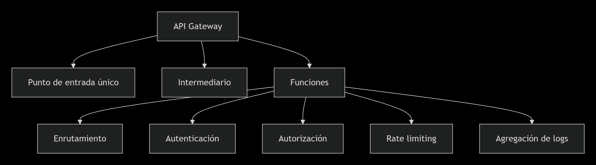

---

## Concepto: RabbitMQ
**Resumen:**
RabbitMQ es un intermediario (broker) de mensajería de código abierto que implementa los protocolos AMQP. Su función principal es la de desacoplar aplicaciones mediante la gestión de colas y el intercambio de mensajes. En este modelo, los productores envían mensajes a un exchange, y este último, siguiendo reglas predefinidas (bindings), los distribuye a las colas correspondientes, de donde son consumidos asíncronamente por los consumidores, mejorando así la resiliencia y la capacidad de manejo de picos de tráfico.

**Mapa Mental:**
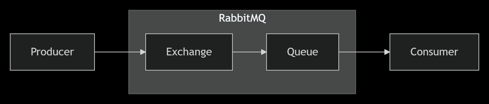

---

## Concepto: Entity Framework Core

### ¿Qué es Entity Framework Core?
**Resumen:**
Entity Framework Core (EF Core) es un mapeador objeto-relacional (ORM) ligero, extensible y multiplataforma para .NET Core. Permite a los desarrolladores interactuar con bases de datos relacionales utilizando objetos .NET y operaciones Language Integrated Query (LINQ), traduciendo automáticamente estas expresiones a comandos SQL específicos del motor de base de datos. De esta forma, se abstrae gran parte del código típico de acceso a datos, mejorando la productividad y mantenibilidad del software.

**Mapa Mental:**
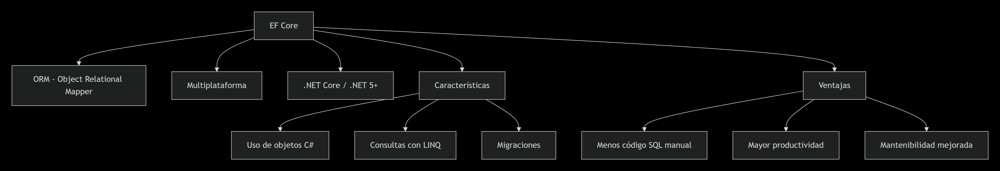

### ¿Qué es DbContext y DbSet?
**Resumen:**
La clase `DbContext` constituye el corazón de la comunicación con la base de datos en EF Core. Representa una sesión con la base de datos y funciona como una unidad de trabajo, permitiendo consultar y persistir datos, así como gestionar transacciones y el seguimiento de cambios. Por otro lado, las propiedades de tipo `DbSet<T>` representan colecciones de entidades específicas; cada `DbSet` se corresponde con una tabla en la base de datos y es a través de ellos que se ejecutan las operaciones de consulta y almacenamiento sobre una entidad en particular.

**Mapa Mental:**
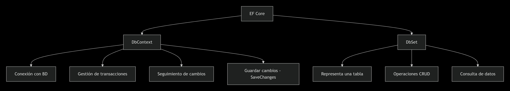

### Database First
**Resumen:**
"Database First" es un flujo de trabajo en EF Core que parte de una base de datos existente. El desarrollador diseña y mantiene el esquema directamente en el Sistema Gestor de Base de Datos (SGBD) utilizando herramientas SQL estándar. Posteriormente, se utiliza un comando, como `Scaffold-DbContext`, para revertir la ingeniería del esquema y generar las clases de entidad y el `DbContext` correspondiente en el código de la aplicación. Es ideal para proyectos heredados o donde el DBA tiene control total sobre la estructura de datos.

**Mapa Mental:**
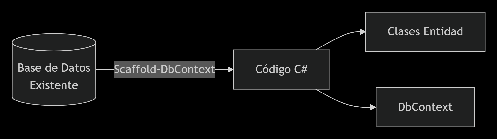

### Code First
**Resumen:**
El enfoque "Code First" sitúa al código de la aplicación como centro de control del modelo de datos. El desarrollador define las clases de entidad y las configuraciones de relaciones (mediante Data Annotations o Fluent API) directamente en C#. A partir de estas definiciones, EF Core puede generar y mantener la base de datos utilizando un sistema de migraciones, que permite versionar y aplicar cambios evolutivos al esquema sin perder datos. Es la opción preferida en proyectos "greenfield" donde se busca un control total desde el código.

**Mapa Mental:**
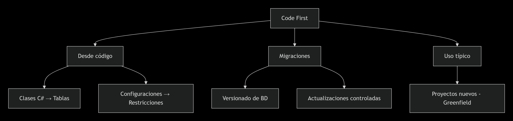

### Claves foráneas
**Resumen:**
En el contexto de Entity Framework Core, las claves foráneas son el mecanismo para representar y gestionar las relaciones entre entidades (uno a uno, uno a muchos, muchos a muchos). Se definen mediante propiedades de navegación y pueden ser configuradas explícitamente con atributos como `[ForeignKey]` o mediante la API fluida. Su propósito es mantener la integridad referencial en la base de datos y permitir la carga de entidades relacionadas a través de métodos como `Include()` o `ThenInclude()`, facilitando la navegación entre objetos en memoria.

**Mapa Mental:**
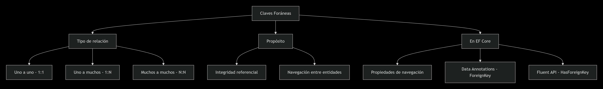

---

## Concepto: Web API
**Resumen:**
Una Web API es un framework de aplicación diseñado para construir servicios HTTP que consumen clientes diversos, como navegadores, aplicaciones móviles u otros servicios. Tradicionalmente asociada a los controladores que heredan de `ControllerBase`, su función es exponer operaciones funcionales a través de un conjunto de endpoints, procesando solicitudes y devolviendo datos (generalmente en formato JSON o XML) mediante códigos de estado HTTP que informan sobre el resultado de la transacción.

**Mapa Mental:**
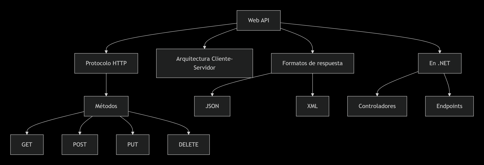

---

## Concepto: API REST en C#
**Resumen:**
Una API RESTful en C# implementa un conjunto de principios arquitectónicos que definen a REST (Representational State Transfer). Esto implica una arquitectura cliente-servidor sin estado (stateless), el uso de una interfaz uniforme mediante los verbos HTTP (GET, POST, etc.), la capacidad de cacheo, un sistema de capas y, opcionalmente, código bajo demanda. En la práctica, con ASP.NET Core, se desarrollan controladores con atributos como `[ApiController]` para aprovechar funcionalidades como la validación automática de modelos y la vinculación de datos de la solicitud a los parámetros de acción.

**Mapa Mental:**
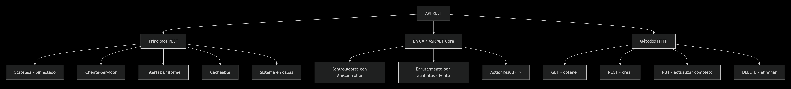

---

## Concepto: Métodos HTTP
**Resumen:**
Los métodos HTTP, o verbos, indican la acción semántica que se desea realizar sobre un recurso identificado por una URL. El ecosistema de una API web descansa sobre los siguientes métodos principales: **GET** (recupera datos de un recurso), **POST** (envía datos para crear un nuevo recurso), **PUT** (reemplaza completamente un recurso existente), **DELETE** (elimina un recurso) y **OPTIONS** (describen las opciones de comunicación disponibles para un endpoint). Estos deben utilizarse con idempotencia (excepto POST) para garantizar previsibilidad.

**Mapa Mental:**
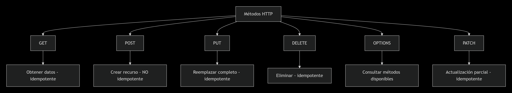

---

## Concepto: Códigos de respuesta (40x, 50x)
**Resumen:**
Los códigos de estado HTTP de la familia 4xx indican un error por parte del cliente: **400 (Bad Request)** cuando la solicitud es malformada, **401 (Unauthorized)** cuando no se provee autenticación, **403 (Forbidden)** cuando el cliente carece de permisos y **404 (Not Found)** cuando el recurso no existe. Los códigos 5xx, por otro lado, denotan un fallo en el servidor: **500 (Internal Server Error)** es un error genérico, **502 (Bad Gateway)** una respuesta inválida de un servidor upstream y **503 (Service Unavailable)** cuando el servidor no está disponible temporalmente.

**Mapa Mental:**
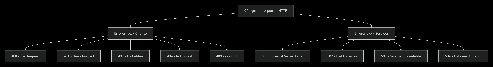

---

## Concepto: Diferencia entre DTO y entidad
**Resumen:**
La principal diferencia reside en su propósito y alcance. Una **Entidad** es un objeto de negocio que representa una tabla en la base de datos, contiene toda la lógica de dominio y puede incluir campos sensibles o relaciones complejas. En contraste, un **DTO (Data Transfer Object)** es un objeto plano y anémico, desprovisto de comportamiento, diseñado exclusivamente para transferir datos entre procesos (por ejemplo, entre la API y el cliente). Se utiliza para optimizar el ancho de banda (evitando enviar datos innecesarios), desacoplar las capas internas de la interfaz pública y mejorar la seguridad al ocultar propiedades que no deben exponerse.

**Mapa Mental:**
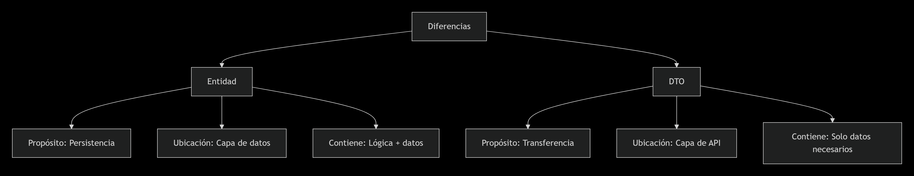

---

## Concepto: Estructura de una aplicación
**Resumen:**
Una aplicación moderna en .NET suele organizarse siguiendo el principio de separación de responsabilidades. Una estructura típica incluye carpetas como **Controllers**, donde se definen los endpoints y se manejan las peticiones HTTP; **Models/Entities**, que contienen la definición de las clases de negocio; **DTOs**, para definir los contratos de datos de entrada y salida; **Services**, que encapsulan la lógica de negocio; **Data/Repositories**, que contienen la lógica de acceso a datos y la conexión a través de `DbContext` y **Middleware**, para componentes que se ejecutan en el pipeline de solicitud.

**Mapa Mental:**
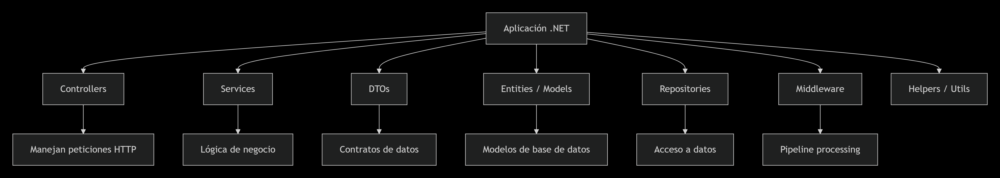

---

## Concepto: Inyección de dependencias
**Resumen:**
La Inyección de Dependencias (DI) es una técnica de diseño de software que implementa el principio de Inversión de Control (IoC). Su objetivo es desacoplar la creación de un objeto de sus dependencias, delegando dicha responsabilidad a un contenedor externo. En lugar de que una clase cree directamente sus propias dependencias (usando `new`), estas le son proporcionadas (inyectadas) desde el exterior, típicamente a través del constructor. Esto favorece la testabilidad, la flexibilidad y el mantenimiento del código, especialmente en aplicaciones de arquitectura limpia.

**Mapa Mental:**
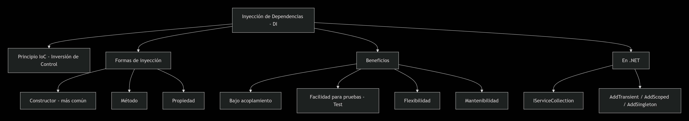

---

## Concepto: Principios SOLID
**Resumen:**
SOLID es un acrónimo que reúne cinco principios fundamentales de la programación orientada a objetos. **S (Responsabilidad Única)** : Una clase debe tener una sola razón para cambiar. **O (Abierto/Cerrado)** : Las entidades deben estar abiertas para la extensión, pero cerradas para la modificación. **L (Sustitución de Liskov)** : Los subtipos deben ser sustituibles por sus tipos base. **I (Segregación de Interfaz)** : Es mejor tener muchas interfaces específicas que una sola de propósito general. **D (Inversión de Dependencias)** : Depender de abstracciones, no de implementaciones concretas.

**Mapa Mental:**
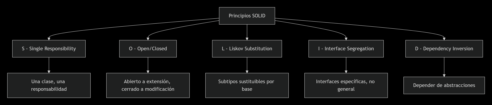

---

## Concepto: Arquitectura en N Capas
**Resumen:**
La arquitectura en N capas organiza el software en capas lógicas, cada una con una responsabilidad específica. La organización clásica contempla una **Capa de Presentación** (la API, responsable de la interacción con el cliente), una **Capa de Lógica de Negocio** (Servicios, donde residen las reglas del dominio) y una **Capa de Acceso a Datos** (Repositorios, encargada de la persistencia). Esta separación reduce el acoplamiento, mejora la mantenibilidad y facilita la evolución de la tecnología en cada nivel.

**Mapa Mental:**
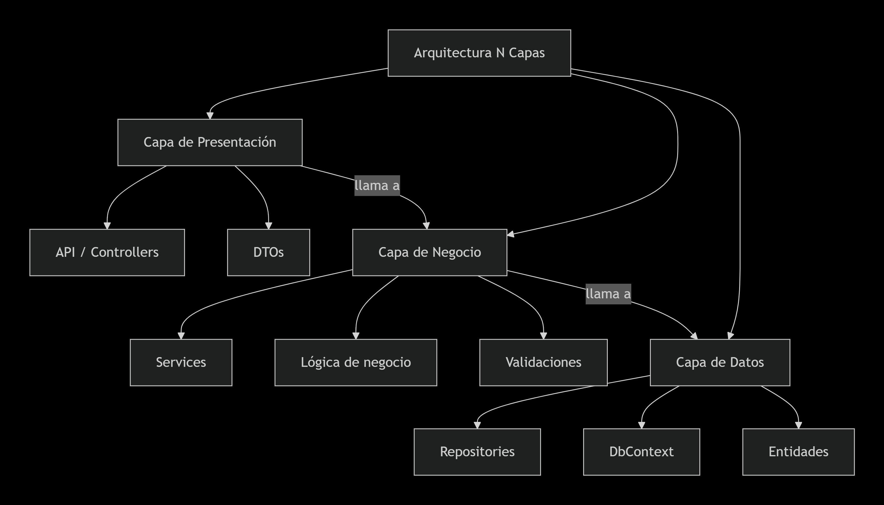

---

## Concepto: Programación asíncrona
**Resumen:**
La programación asíncrona es un modelo de concurrencia que permite ejecutar operaciones sin bloquear el hilo principal de ejecución. En C#, se implementa mediante las palabras clave `async` y `await`. Una operación asíncrona (como leer un archivo o llamar a una API) libera al hilo actual mientras espera la respuesta, permitiéndole atender otras solicitudes. Esto es crucial en aplicaciones de servidor (APIs) para mejorar la escalabilidad y el rendimiento, ya que optimiza el uso de los recursos del sistema sin desperdiciar hilos en esperas pasivas.

**Mapa Mental:**
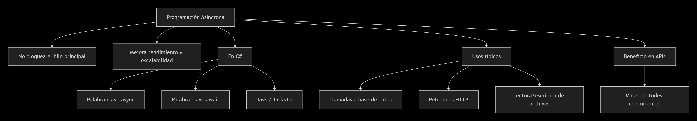

---

## Concepto: Docker
**Resumen:**
Docker es una plataforma de virtualización a nivel de sistema operativo que automatiza el despliegue de aplicaciones dentro de contenedores. Un contenedor es una unidad de software ligera y portátil que empaqueta el código de la aplicación junto con todas sus dependencias (bibliotecas, runtime, herramientas) de forma estandarizada. A diferencia de las máquinas virtuales, los contenedores comparten el kernel del sistema operativo anfitrión, lo que los hace mucho más eficientes en el uso de recursos y más rápidos de iniciar, garantizando que la aplicación funcione de manera idéntica en cualquier entorno.

**Mapa Mental:**
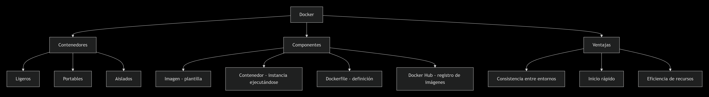

---

## Concepto: Kubernetes
**Resumen:**
Kubernetes (K8s) es un sistema de código abierto para la orquestación de contenedores. Su función es automatizar la implementación, el escalado y la gestión de aplicaciones empaquetadas en contenedores a lo largo de un clúster de servidores. Kubernetes abstrae la infraestructura subyacente, permitiendo definir el "estado deseado" de una aplicación (número de réplicas, red, almacenamiento). El sistema se encarga de mantener ese estado, gestionando automáticamente el balanceo de carga, los reinicios de contenedores fallidos, las actualizaciones graduales (rolling updates) y la asignación de recursos.

**Mapa Mental:**
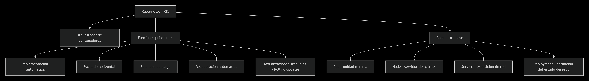

---

## Conclusión personal
Tras la elaboración de este compendio teórico, he podido constatar la complejidad inherente al desarrollo de sistemas distribuidos modernos. Se evidencia un claro tránsito desde los modelos monolíticos hacia arquitecturas desagregadas (microservicios) que exigen un dominio profundo de patrones de comunicación asíncrona, herramientas de orquestación y principios de diseño robustos. Comprender la interacción entre un ORM como Entity Framework Core, la inyección de dependencias y los principios SOLID no es solo un requisito académico, sino la base para construir software profesional, mantenible y escalable en el ecosistema .NET.
